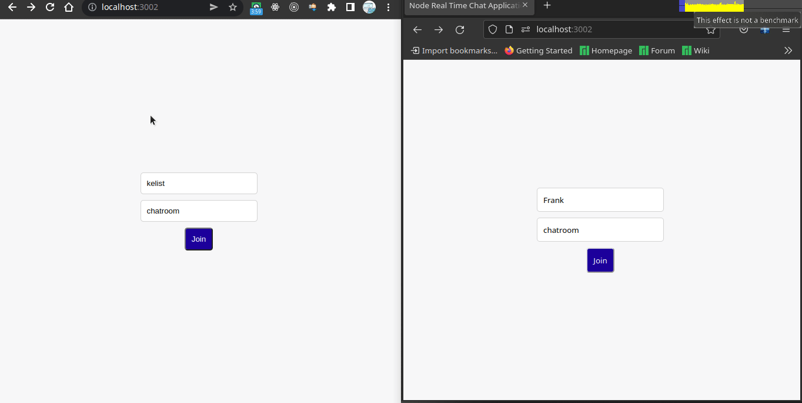

# liNodechats

An express chat application, that allows user to create and join chatrooms and send chat messages

## Built With

- NodeJs
- Express, MUstacheJs, Axios
- HTML, Css,

# Screenshot

## Getting Started

To get a local copy up and running follow these simple example steps.

## Prerequisites

- install NPM

### Setup

Run the following code from the terminal

1. Clone the repo

- git clone

2. change dirrectory into the applications directory

- cd nodeWeather

3. install the required dependencies

- npm install

4. Start the application

- npm run dev

### Usage

open you browser and navigate to

http://localhost:3002/

## Authors

👤 **Author1**

- Github: [@kelibst](https://github.com/kelibst)
- Twitter: [@keli_booster](https://twitter.com/keli_booster)
- LinkedIn: [Kekeli (Jiresse) Dogbevi](https://www.linkedin.com/in/kelibst/)

## 🤝 Contributing

Contributions, issues, and feature requests are welcome!

Feel free to check the [issues page](../../issues/).

## Show your support

Give a ⭐️ if you like this project!

## Acknowledgments

- Hat tip to anyone whose code was used
- Inspiration
- etc

## 📝 License

This project is [MIT](./MIT.md) licensed.
